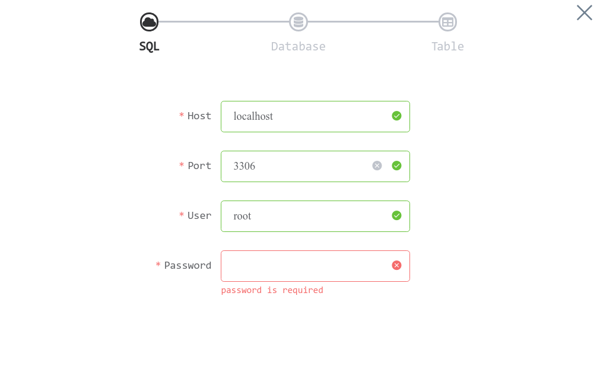
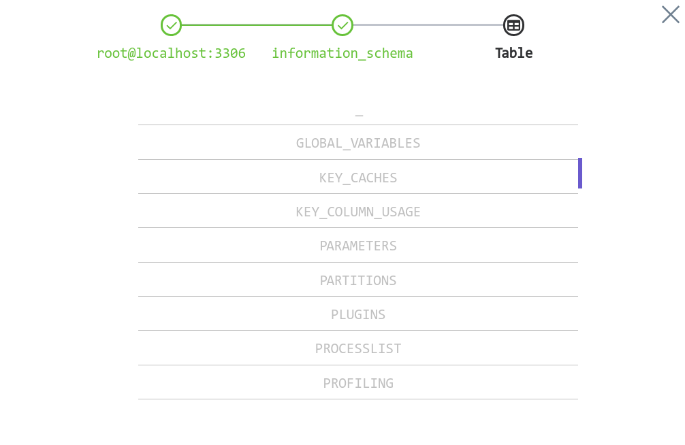
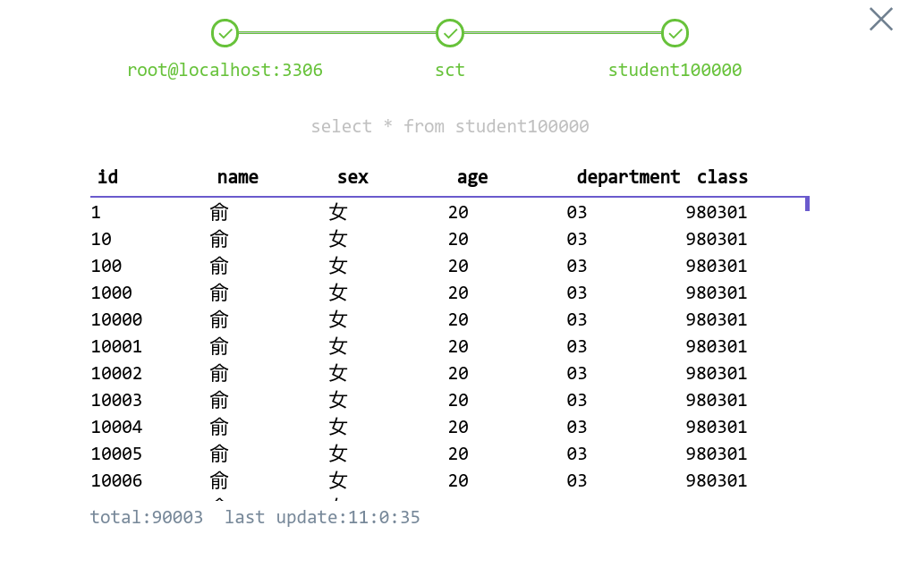
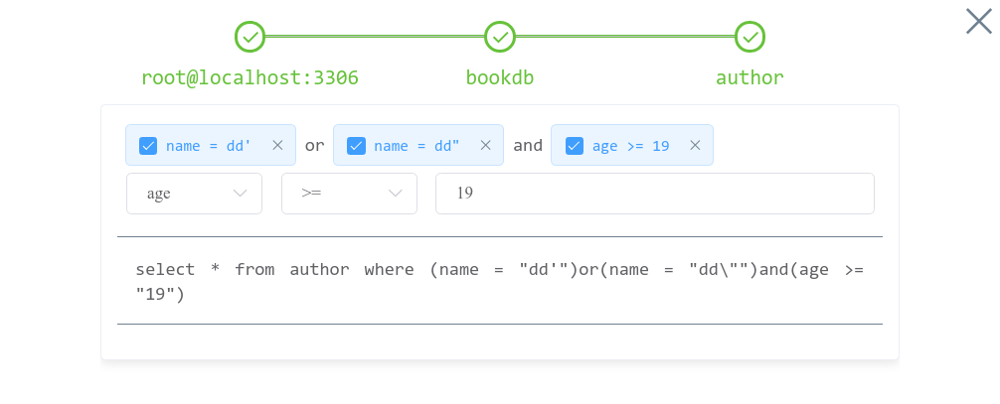

# mysql/mariadb simple search app


### what you can do

1. `Enter`/`Double Click` to confirm
1. connect to sql, select database, select table

2. add filter/condition, toggle `and`/`or`

### features

values with (double)quotes is fine

**no scorll lag**

- 10^5 rows can be easily handled

- 10^7 rows can be handeld but still with bug

### preview

<div float="center" style='margin:0'>
  
   
</div>



### how to run 

``` bash
yarn
yarn run dev
```
---

This app is heavily limited to my homework requirement

This project was generated with [electron-vue](https://github.com/SimulatedGREG/electron-vue), thanks